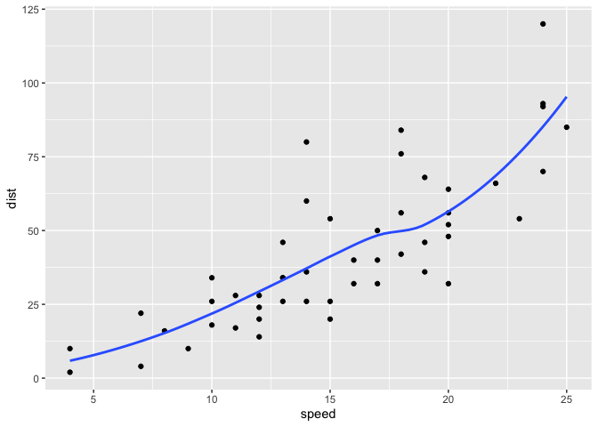
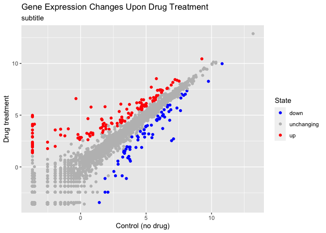
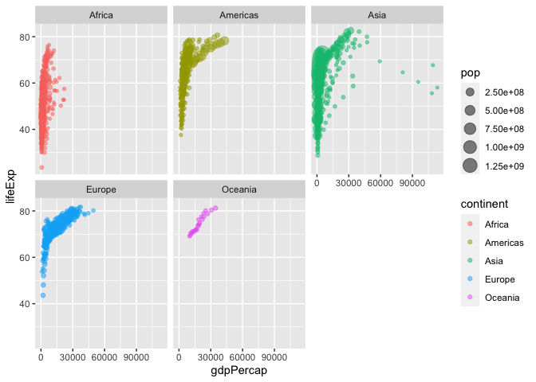

Class 5: Data Visualization
================
Suzanne Enos

\#Plotting in R

R has many plotting and visualization systems including “base” R.

``` r
head(cars)
```

      speed dist
    1     4    2
    2     4   10
    3     7    4
    4     7   22
    5     8   16
    6     9   10

``` r
plot(cars)
```


Base R plots can be quite simple for basic plots when compared to
systems like ggplot

``` r
library(ggplot2)
ggplot(cars)
```


Every ggplot needs at least three things

- **Data** (data.frame with what we want to plot)
- **Aesthetics** (aes - how the data map to the plot)
- **Geometry** (geoms - type of plot)

``` r
ggplot(cars) + 
  aes(x = speed, y = dist) + 
  geom_point() + 
  geom_smooth(se = FALSE)
```

    `geom_smooth()` using method = 'loess' and formula = 'y ~ x'



\##A plot of some gene expression data

The code to read the data:

``` r
url <- "https://bioboot.github.io/bimm143_S20/class-material/up_down_expression.txt"
genes <- read.delim(url)
head(genes)
```

            Gene Condition1 Condition2      State
    1      A4GNT -3.6808610 -3.4401355 unchanging
    2       AAAS  4.5479580  4.3864126 unchanging
    3      AASDH  3.7190695  3.4787276 unchanging
    4       AATF  5.0784720  5.0151916 unchanging
    5       AATK  0.4711421  0.5598642 unchanging
    6 AB015752.4 -3.6808610 -3.5921390 unchanging

> Q. How many genes are in this dataset?

``` r
nrow(genes)
```

    [1] 5196

There are ‘r nrow(genes)’ genes in this dataset.

> How many genes are up-regulated?

``` r
table(genes$State)
```


          down unchanging         up 
            72       4997        127 

``` r
sum(genes$State == "up")
```

    [1] 127

``` r
p <- ggplot(genes) +
  aes(x = Condition1, y = Condition2, color = State) +
  geom_point() 
p
```


Can save ggplot object as ‘p’ to use later and add layers p + \_\_.

``` r
p + scale_colour_manual( values=c("blue","gray","red") ) + 
  labs(title = "Gene Expression Changes Upon Drug Treatment", subtitle = "subtitle") +
  xlab("Control (no drug)") +
  ylab("Drug treatment")
```



``` r
library(gapminder)
library(dplyr)
```


    Attaching package: 'dplyr'

    The following objects are masked from 'package:stats':

        filter, lag

    The following objects are masked from 'package:base':

        intersect, setdiff, setequal, union

``` r
gapminder_2007 <- gapminder %>% filter(year==2007)
```

> Q. How many countries are in this dataset?

``` r
length(unique(gapminder$country))
```

    [1] 142

> How many years do we have data for?

``` r
range(gapminder$year)
```

    [1] 1952 2007

> Which country has the smallest population? What is the the smallest
> pop

``` r
min(gapminder$pop)
```

    [1] 60011

> First, where is this min value in the pop vector

``` r
ind <- which.min(gapminder$pop)
```

``` r
gapminder$country[ind]
```

    [1] Sao Tome and Principe
    142 Levels: Afghanistan Albania Algeria Angola Argentina Australia ... Zimbabwe

``` r
gapminder[ind,]
```

    # A tibble: 1 × 6
      country               continent  year lifeExp   pop gdpPercap
      <fct>                 <fct>     <int>   <dbl> <int>     <dbl>
    1 Sao Tome and Principe Africa     1952    46.5 60011      880.

``` r
ggplot(gapminder) +
  aes(x=gdpPercap, y=lifeExp, color = continent, size = pop) +
  geom_point(alpha=0.5) +
  facet_wrap(~continent)
```


