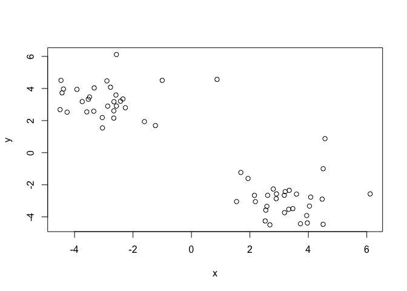
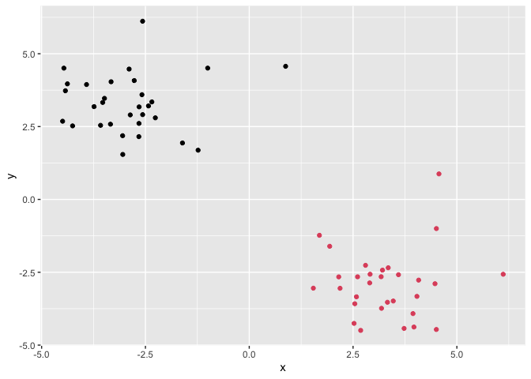
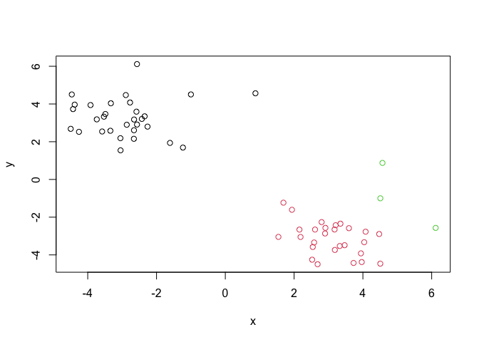
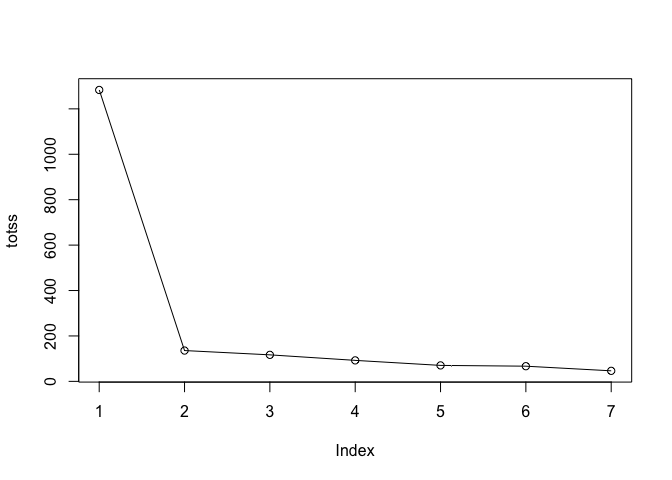
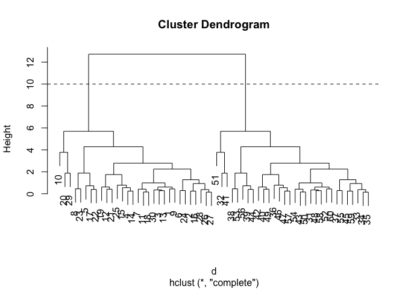
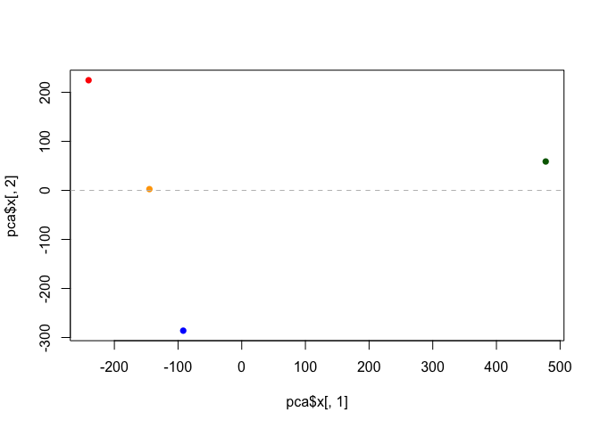
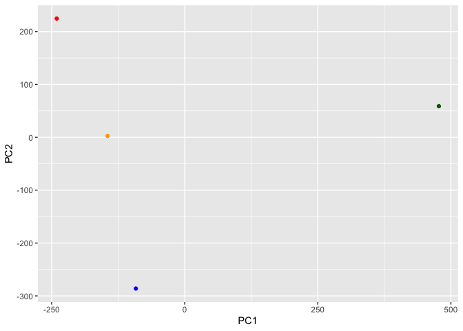
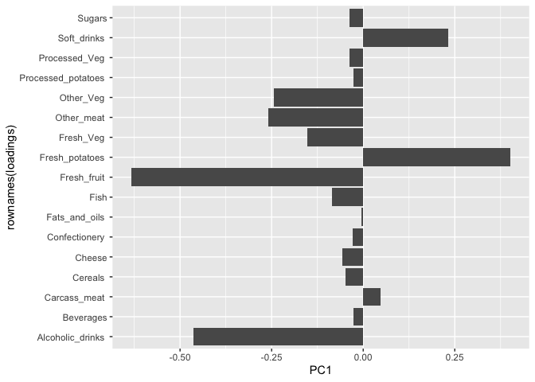

Class 7: Machine Learning 1
================
Suzanne Enos

In this class, we will explore and get practice with clustering and
Principal Component Analysis (PCA) \# Clustering with K-means

First we will make up some data to cluster where we know what the result
should be.

``` r
hist(rnorm(300000, mean = -3))
```


I want a little vector with two groupings in it:

``` r
tmp <-c(rnorm(30, -3), rnorm(30, +3))
x <- data.frame(x = tmp, y = rev(tmp))
head(x)
```

              x        y
    1 -2.655308 2.608474
    2 -3.580662 2.542520
    3 -2.652601 3.176813
    4 -4.427162 3.729124
    5 -3.045897 1.543493
    6 -4.494883 2.683478

``` r
plot(x)
```



``` r
km <- kmeans(x, centers = 2)
km
```

    K-means clustering with 2 clusters of sizes 30, 30

    Cluster means:
              x         y
    1 -2.908203  3.276571
    2  3.276571 -2.908203

    Clustering vector:
     [1] 1 1 1 1 1 1 1 1 1 1 1 1 1 1 1 1 1 1 1 1 1 1 1 1 1 1 1 1 1 1 2 2 2 2 2 2 2 2
    [39] 2 2 2 2 2 2 2 2 2 2 2 2 2 2 2 2 2 2 2 2 2 2

    Within cluster sum of squares by cluster:
    [1] 67.83551 67.83551
     (between_SS / total_SS =  89.4 %)

    Available components:

    [1] "cluster"      "centers"      "totss"        "withinss"     "tot.withinss"
    [6] "betweenss"    "size"         "iter"         "ifault"      

It’s important to not just run the analysis but to be able to get your
important results back in a way that we can do things with them.

> Q. How do I find the cluster size?

``` r
km$size
```

    [1] 30 30

> Q. How about the cluster centers?

``` r
km$centers
```

              x         y
    1 -2.908203  3.276571
    2  3.276571 -2.908203

> Q. How about the main result - the cluster assignment vector?

``` r
km$cluster
```

     [1] 1 1 1 1 1 1 1 1 1 1 1 1 1 1 1 1 1 1 1 1 1 1 1 1 1 1 1 1 1 1 2 2 2 2 2 2 2 2
    [39] 2 2 2 2 2 2 2 2 2 2 2 2 2 2 2 2 2 2 2 2 2 2

> Q. Can we make a summary figure showing our clustering result? - The
> points colored by cluster assignament and maybe add the cluster
> centers as a different color?

``` r
plot(x, col = km$cluster)
```


``` r
library(ggplot2)
ggplot(x) + 
  aes(x, y) +
  geom_point(col = km$cluster)
```



``` r
# Make up a color vector
mycols <- rep( "gray", 60)
mycols
```

     [1] "gray" "gray" "gray" "gray" "gray" "gray" "gray" "gray" "gray" "gray"
    [11] "gray" "gray" "gray" "gray" "gray" "gray" "gray" "gray" "gray" "gray"
    [21] "gray" "gray" "gray" "gray" "gray" "gray" "gray" "gray" "gray" "gray"
    [31] "gray" "gray" "gray" "gray" "gray" "gray" "gray" "gray" "gray" "gray"
    [41] "gray" "gray" "gray" "gray" "gray" "gray" "gray" "gray" "gray" "gray"
    [51] "gray" "gray" "gray" "gray" "gray" "gray" "gray" "gray" "gray" "gray"

``` r
plot(x, col = mycols)
```


Let’s highligh points 10, 12, and 20

``` r
mycols[c(10, 12, 20)] <- "red"
plot(x, col = mycols, pch = 18)
```


Play with different number of centers

``` r
km <- kmeans(x, centers = 3)
plot(x, col = km$cluster)
```



``` r
km$tot.withinss
```

    [1] 111.5475

What we want to do is try out different number of K from 1 to 7. We cna
write a `for` loop to do this for us and sotr the `$tot.withinss` each
time.

``` r
totss <- NULL
k <- 1:7

for(i in k) {
  totss <- c(totss, kmeans(x, centers = i)$tot.withinss)
}
```

``` r
plot(totss, typ = "o")
```



Inflection point at 2 totss. 2 clusters is best.

# Hierarchical Clustering

We cannot just give the `hclust()` function of input data `x` like we
did for `kmeans()`.

We need to first calculate a “distance matrix”. the `dist()` function by
default will calculate euclidean distance.

``` r
d <- dist(x)
hc <- hclust(d)
hc
```


    Call:
    hclust(d = d)

    Cluster method   : complete 
    Distance         : euclidean 
    Number of objects: 60 

The print out is not very helpful, but the plot method is useful.

``` r
plot(hc)
abline(h = 10, cor = "red", lty = 2)
```

    Warning in int_abline(a = a, b = b, h = h, v = v, untf = untf, ...): "cor" is
    not a graphical parameter



To get my all important cluster membership vector out of a hclust object
I can use the `cutree()`

``` r
cutree(hc, h=10)
```

     [1] 1 1 1 1 1 1 1 1 1 1 1 1 1 1 1 1 1 1 1 1 1 1 1 1 1 1 1 1 1 1 2 2 2 2 2 2 2 2
    [39] 2 2 2 2 2 2 2 2 2 2 2 2 2 2 2 2 2 2 2 2 2 2

You can also set a `k=` argument to `cutree()`.

``` r
grps <- cutree(hc, k=2)
```

``` r
plot(x, col = grps)
```


# Principal Component Analysis (PCA)

PCA projects the features onto the principal components. The motivation
is to reduce the feature’s dimensionality.

The main base R function to do PCA is called `prcomp()`.

## PCA of UK food

First, need ot import the data.

``` r
url <- "https://tinyurl.com/UK-foods"
x <- read.csv(url, row.names = 1)
head(x)
```

                   England Wales Scotland N.Ireland
    Cheese             105   103      103        66
    Carcass_meat       245   227      242       267
    Other_meat         685   803      750       586
    Fish               147   160      122        93
    Fats_and_oils      193   235      184       209
    Sugars             156   175      147       139

``` r
dim(x)
```

    [1] 17  4

> Q2. Prefer `row.names = 1` argument to `read.csv` because the other
> way, `x <- x[,-1]`, if you run it multiple times it will remove data.

``` r
barplot(as.matrix(x), beside=T, col=rainbow(nrow(x)))
```


> Q3. Changing the `beside =` argument from T to F gives this plot

``` r
barplot(as.matrix(x), beside=F, col=rainbow(nrow(x)))
```


``` r
pairs(x, col=rainbow(10), pch=16)
```


> Q5. The plots are comparing each of the countries’ data with that of
> one other country, in a pair. A point of the diagonal means it is very
> similar for the two countries (the x and y coordinates are
> approximately the same).

> Q6. The orange and blue points look most different for N. Ireland from
> the other countries in the UK.

For PCA, we need the transpose of our food data.

``` r
pca <-prcomp(t(x))
summary(pca)
```

    Importance of components:
                                PC1      PC2      PC3       PC4
    Standard deviation     324.1502 212.7478 73.87622 4.189e-14
    Proportion of Variance   0.6744   0.2905  0.03503 0.000e+00
    Cumulative Proportion    0.6744   0.9650  1.00000 1.000e+00

``` r
attributes(pca)
```

    $names
    [1] "sdev"     "rotation" "center"   "scale"    "x"       

    $class
    [1] "prcomp"

``` r
pca$x
```

                     PC1         PC2         PC3           PC4
    England   -144.99315    2.532999 -105.768945  2.842865e-14
    Wales     -240.52915  224.646925   56.475555  7.804382e-13
    Scotland   -91.86934 -286.081786   44.415495 -9.614462e-13
    N.Ireland  477.39164   58.901862    4.877895  1.448078e-13

Make my PC1 vs PC2 plot, “score plot”, “pca plot”

``` r
mycols <- c("orange", "red", "blue", "darkgreen")
plot(pca$x[,1], pca$x[,2], col= mycols, pch=16)
abline(h=0, col="gray", lty=2)
```



``` r
pc <- as.data.frame(pca$x)

ggplot(pc) +
  aes(PC1, PC2) +
  geom_point(col=mycols)
```



Let’s look at how the original variables contribute to our new axis fo
max variance, aka PCs

``` r
loadings <- as.data.frame(pca$rotation)

ggplot(loadings) +
  aes(PC1, rownames(loadings)) +
  geom_col()
```


