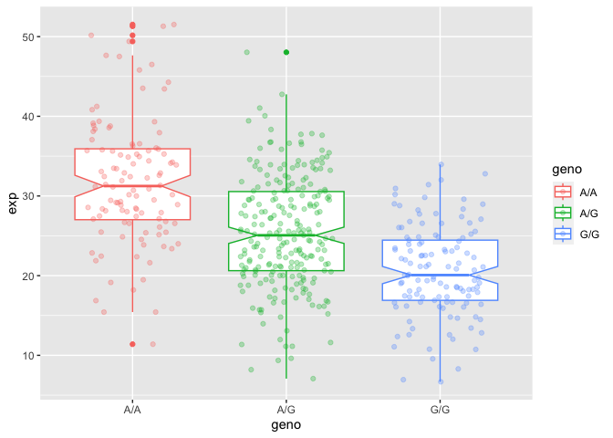

Class 11: Genomics
================
Suzanne Enos

> Q5: What proportion of the Mexican Ancestry in Los Angeles sample
> population (MXL) are homozygous for the asthma associated SNP (G\|G)?

``` r
gene <- read.csv("rs8067378.csv", row.names = 1)
head(gene)
```

                Genotype..forward.strand. Population.s. Father Mother
    NA19648 (F)                       A|A ALL, AMR, MXL      -      -
    NA19649 (M)                       G|G ALL, AMR, MXL      -      -
    NA19651 (F)                       A|A ALL, AMR, MXL      -      -
    NA19652 (M)                       G|G ALL, AMR, MXL      -      -
    NA19654 (F)                       G|G ALL, AMR, MXL      -      -
    NA19655 (M)                       A|G ALL, AMR, MXL      -      -

``` r
table(gene$Genotype..forward.strand.)
```


    A|A A|G G|A G|G 
     22  21  12   9 

``` r
table(gene$Genotype..forward.strand.)/nrow(gene)
```


         A|A      A|G      G|A      G|G 
    0.343750 0.328125 0.187500 0.140625 

# Population Scale Analysis

> Q13. Read this file into R and determine the sample size for each
> genotype and their corresponding median expression levels for each of
> these genotypes.

``` r
results <- read.table("rs8067378_ENSG00000172057.6.txt")
head(results)
```

       sample geno      exp
    1 HG00367  A/G 28.96038
    2 NA20768  A/G 20.24449
    3 HG00361  A/A 31.32628
    4 HG00135  A/A 34.11169
    5 NA18870  G/G 18.25141
    6 NA11993  A/A 32.89721

``` r
summary(results)
```

        sample              geno                exp        
     Length:462         Length:462         Min.   : 6.675  
     Class :character   Class :character   1st Qu.:20.004  
     Mode  :character   Mode  :character   Median :25.116  
                                           Mean   :25.640  
                                           3rd Qu.:30.779  
                                           Max.   :51.518  

``` r
table(results$geno)
```


    A/A A/G G/G 
    108 233 121 

``` r
inds <- results$geno == "G/G"
summary(results$exp[inds])
```

       Min. 1st Qu.  Median    Mean 3rd Qu.    Max. 
      6.675  16.903  20.074  20.594  24.457  33.956 

``` r
inds <- results$geno == "A/G"
summary(results$exp[inds])
```

       Min. 1st Qu.  Median    Mean 3rd Qu.    Max. 
      7.075  20.626  25.065  25.397  30.552  48.034 

``` r
inds <- results$geno == "A/A"
summary(results$exp[inds])
```

       Min. 1st Qu.  Median    Mean 3rd Qu.    Max. 
      11.40   27.02   31.25   31.82   35.92   51.52 

> Q14. Generate a boxplot with a box per genotype, what could you infer
> from the relative expression value between A/A and G/G displayed in
> this plot? Does the SNP effect the expression of ORMDL3?

``` r
library(ggplot2)

ggplot(results) + 
  aes(geno, exp, col = geno) +
  geom_boxplot(notch = T) +
  geom_jitter(alpha = 0.3, width = 0.3)
```


