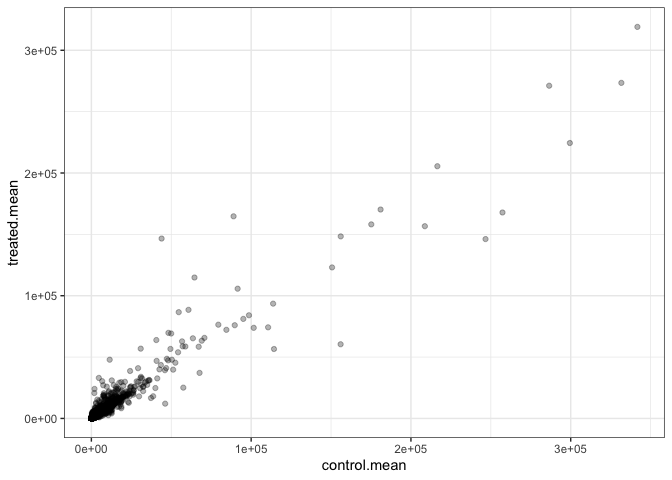
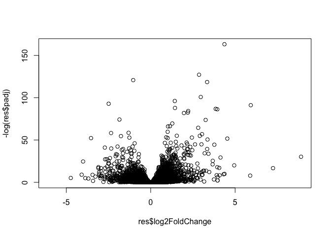
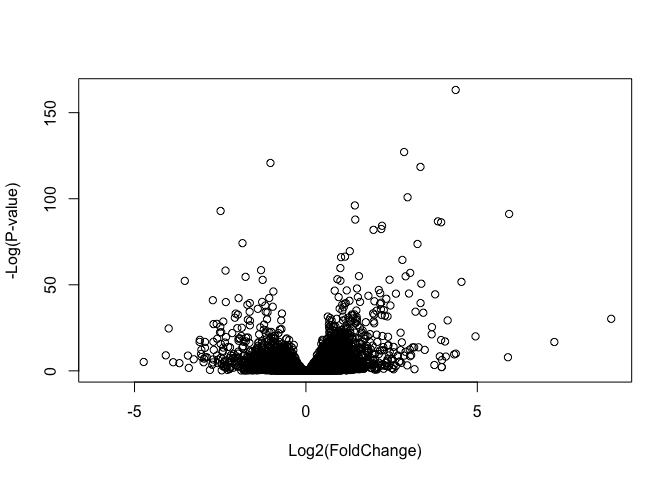

Class 12: RNASeq
================
Suzanne Enos

# Import the data

Count data is the number of reads for each gene for each sample. Col
data/metadata is information about the samples and columns of data.

``` r
counts <- read.csv("airway_scaledcounts.csv", row.names = 1)
metadata <- read.csv("airway_metadata.csv")
```

``` r
head(counts)
```

                    SRR1039508 SRR1039509 SRR1039512 SRR1039513 SRR1039516
    ENSG00000000003        723        486        904        445       1170
    ENSG00000000005          0          0          0          0          0
    ENSG00000000419        467        523        616        371        582
    ENSG00000000457        347        258        364        237        318
    ENSG00000000460         96         81         73         66        118
    ENSG00000000938          0          0          1          0          2
                    SRR1039517 SRR1039520 SRR1039521
    ENSG00000000003       1097        806        604
    ENSG00000000005          0          0          0
    ENSG00000000419        781        417        509
    ENSG00000000457        447        330        324
    ENSG00000000460         94        102         74
    ENSG00000000938          0          0          0

``` r
head(metadata)
```

              id     dex celltype     geo_id
    1 SRR1039508 control   N61311 GSM1275862
    2 SRR1039509 treated   N61311 GSM1275863
    3 SRR1039512 control  N052611 GSM1275866
    4 SRR1039513 treated  N052611 GSM1275867
    5 SRR1039516 control  N080611 GSM1275870
    6 SRR1039517 treated  N080611 GSM1275871

``` r
metadata$id == colnames(counts)
```

    [1] TRUE TRUE TRUE TRUE TRUE TRUE TRUE TRUE

``` r
all(metadata$id == colnames(counts))
```

    [1] TRUE

> Q1. How many genes are in the dataset?

``` r
nrow(counts)
```

    [1] 38694

> Q2. How many control cell lines do we have?

``` r
sum(metadata$dex == "control")
```

    [1] 4

> Q3. How would you make the above code more robust?

``` r
control.id <- metadata[metadata$dex == "control",]$id
```

> Q4. Q4. Follow the same procedure for the treated samples
> (i.e. calculate the mean per gene across drug treated samples and
> assign to a labeled vector called treated.mean)

``` r
control.counts <- counts[, control.id]
head(control.counts)
```

                    SRR1039508 SRR1039512 SRR1039516 SRR1039520
    ENSG00000000003        723        904       1170        806
    ENSG00000000005          0          0          0          0
    ENSG00000000419        467        616        582        417
    ENSG00000000457        347        364        318        330
    ENSG00000000460         96         73        118        102
    ENSG00000000938          0          1          2          0

``` r
control.mean <- rowMeans(control.counts)
head(control.mean)
```

    ENSG00000000003 ENSG00000000005 ENSG00000000419 ENSG00000000457 ENSG00000000460 
             900.75            0.00          520.50          339.75           97.25 
    ENSG00000000938 
               0.75 

``` r
control.treated <- metadata[metadata$dex == "treated",]$id

treated.counts <- counts[, control.treated]
head(control.treated)
```

    [1] "SRR1039509" "SRR1039513" "SRR1039517" "SRR1039521"

``` r
treated.mean <- rowMeans(treated.counts)
head(treated.mean)
```

    ENSG00000000003 ENSG00000000005 ENSG00000000419 ENSG00000000457 ENSG00000000460 
             658.00            0.00          546.00          316.50           78.75 
    ENSG00000000938 
               0.00 

Reorganize to create meancounts dataframe.

``` r
mean.counts <- data.frame(control.mean, treated.mean)
head(mean.counts)
```

                    control.mean treated.mean
    ENSG00000000003       900.75       658.00
    ENSG00000000005         0.00         0.00
    ENSG00000000419       520.50       546.00
    ENSG00000000457       339.75       316.50
    ENSG00000000460        97.25        78.75
    ENSG00000000938         0.75         0.00

``` r
colSums(mean.counts)
```

    control.mean treated.mean 
        23005324     22196524 

> Q5. Scatterplot of meancounts

``` r
plot(mean.counts)
```


``` r
library(ggplot2)

ggplot(mean.counts) +
  aes(control.mean, treated.mean) +
  geom_point(alpha = 0.3) +
  theme_bw()
```



Data is very skewed.

Q6. Try plotting both axes on a log scale. What is the argument to
plot() that allows you to do this?

``` r
plot(mean.counts, log = "xy")
```

    Warning in xy.coords(x, y, xlabel, ylabel, log): 15032 x values <= 0 omitted
    from logarithmic plot

    Warning in xy.coords(x, y, xlabel, ylabel, log): 15281 y values <= 0 omitted
    from logarithmic plot


We usually look at the log2 of the fold change, because this has better
mathematical properties.

Here we calculate log2foldchange, add it to our meancounts data.frame
and inspect the results either with the head() or the View() function
for example.

``` r
mean.counts$log2fc <- log2(mean.counts$treated.mean/mean.counts$control.mean)
head(mean.counts)
```

                    control.mean treated.mean      log2fc
    ENSG00000000003       900.75       658.00 -0.45303916
    ENSG00000000005         0.00         0.00         NaN
    ENSG00000000419       520.50       546.00  0.06900279
    ENSG00000000457       339.75       316.50 -0.10226805
    ENSG00000000460        97.25        78.75 -0.30441833
    ENSG00000000938         0.75         0.00        -Inf

Filter to remove genes with zero expression

``` r
to.keep <- rowSums(mean.counts[,1:2] == 0) == 0
my.counts <- mean.counts[to.keep,]
nrow(my.counts)
```

    [1] 21817

``` r
head(my.counts)
```

                    control.mean treated.mean      log2fc
    ENSG00000000003       900.75       658.00 -0.45303916
    ENSG00000000419       520.50       546.00  0.06900279
    ENSG00000000457       339.75       316.50 -0.10226805
    ENSG00000000460        97.25        78.75 -0.30441833
    ENSG00000000971      5219.00      6687.50  0.35769358
    ENSG00000001036      2327.00      1785.75 -0.38194109

> Q8. How many genes are upregulated? (log2fc threshold of +2)

Log fold change of 2 means a 4 fold change - above +2 means upregulated
genes, below -2 means downregulated genes

``` r
sum(my.counts$log2fc >= +2)
```

    [1] 314

> Q9. How many genes are downregulated?

``` r
sum(my.counts$log2fc <= -2)
```

    [1] 485

> Q10. Do you trust these results?

No, because we’re missing statistical significance values.

# DESeq

``` r
library(DESeq2)
```

    Loading required package: S4Vectors

    Loading required package: stats4

    Loading required package: BiocGenerics


    Attaching package: 'BiocGenerics'

    The following objects are masked from 'package:stats':

        IQR, mad, sd, var, xtabs

    The following objects are masked from 'package:base':

        anyDuplicated, aperm, append, as.data.frame, basename, cbind,
        colnames, dirname, do.call, duplicated, eval, evalq, Filter, Find,
        get, grep, grepl, intersect, is.unsorted, lapply, Map, mapply,
        match, mget, order, paste, pmax, pmax.int, pmin, pmin.int,
        Position, rank, rbind, Reduce, rownames, sapply, setdiff, sort,
        table, tapply, union, unique, unsplit, which.max, which.min


    Attaching package: 'S4Vectors'

    The following objects are masked from 'package:base':

        expand.grid, I, unname

    Loading required package: IRanges

    Loading required package: GenomicRanges

    Loading required package: GenomeInfoDb

    Loading required package: SummarizedExperiment

    Loading required package: MatrixGenerics

    Loading required package: matrixStats


    Attaching package: 'MatrixGenerics'

    The following objects are masked from 'package:matrixStats':

        colAlls, colAnyNAs, colAnys, colAvgsPerRowSet, colCollapse,
        colCounts, colCummaxs, colCummins, colCumprods, colCumsums,
        colDiffs, colIQRDiffs, colIQRs, colLogSumExps, colMadDiffs,
        colMads, colMaxs, colMeans2, colMedians, colMins, colOrderStats,
        colProds, colQuantiles, colRanges, colRanks, colSdDiffs, colSds,
        colSums2, colTabulates, colVarDiffs, colVars, colWeightedMads,
        colWeightedMeans, colWeightedMedians, colWeightedSds,
        colWeightedVars, rowAlls, rowAnyNAs, rowAnys, rowAvgsPerColSet,
        rowCollapse, rowCounts, rowCummaxs, rowCummins, rowCumprods,
        rowCumsums, rowDiffs, rowIQRDiffs, rowIQRs, rowLogSumExps,
        rowMadDiffs, rowMads, rowMaxs, rowMeans2, rowMedians, rowMins,
        rowOrderStats, rowProds, rowQuantiles, rowRanges, rowRanks,
        rowSdDiffs, rowSds, rowSums2, rowTabulates, rowVarDiffs, rowVars,
        rowWeightedMads, rowWeightedMeans, rowWeightedMedians,
        rowWeightedSds, rowWeightedVars

    Loading required package: Biobase

    Welcome to Bioconductor

        Vignettes contain introductory material; view with
        'browseVignettes()'. To cite Bioconductor, see
        'citation("Biobase")', and for packages 'citation("pkgname")'.


    Attaching package: 'Biobase'

    The following object is masked from 'package:MatrixGenerics':

        rowMedians

    The following objects are masked from 'package:matrixStats':

        anyMissing, rowMedians

``` r
citation("DESeq2")
```


    To cite package 'DESeq2' in publications use:

      Love, M.I., Huber, W., Anders, S. Moderated estimation of fold change
      and dispersion for RNA-seq data with DESeq2 Genome Biology 15(12):550
      (2014)

    A BibTeX entry for LaTeX users is

      @Article{,
        title = {Moderated estimation of fold change and dispersion for RNA-seq data with DESeq2},
        author = {Michael I. Love and Wolfgang Huber and Simon Anders},
        year = {2014},
        journal = {Genome Biology},
        doi = {10.1186/s13059-014-0550-8},
        volume = {15},
        issue = {12},
        pages = {550},
      }

``` r
dds <- DESeqDataSetFromMatrix(countData = counts, 
                              colData = metadata, 
                              design = ~dex)
```

    converting counts to integer mode

    Warning in DESeqDataSet(se, design = design, ignoreRank): some variables in
    design formula are characters, converting to factors

``` r
dds
```

    class: DESeqDataSet 
    dim: 38694 8 
    metadata(1): version
    assays(1): counts
    rownames(38694): ENSG00000000003 ENSG00000000005 ... ENSG00000283120
      ENSG00000283123
    rowData names(0):
    colnames(8): SRR1039508 SRR1039509 ... SRR1039520 SRR1039521
    colData names(4): id dex celltype geo_id

DESeq analysis

``` r
dds <- DESeq(dds)
```

    estimating size factors

    estimating dispersions

    gene-wise dispersion estimates

    mean-dispersion relationship

    final dispersion estimates

    fitting model and testing

Getting results

``` r
res <- results(dds)
head(res)
```

    log2 fold change (MLE): dex treated vs control 
    Wald test p-value: dex treated vs control 
    DataFrame with 6 rows and 6 columns
                      baseMean log2FoldChange     lfcSE      stat    pvalue
                     <numeric>      <numeric> <numeric> <numeric> <numeric>
    ENSG00000000003 747.194195     -0.3507030  0.168246 -2.084470 0.0371175
    ENSG00000000005   0.000000             NA        NA        NA        NA
    ENSG00000000419 520.134160      0.2061078  0.101059  2.039475 0.0414026
    ENSG00000000457 322.664844      0.0245269  0.145145  0.168982 0.8658106
    ENSG00000000460  87.682625     -0.1471420  0.257007 -0.572521 0.5669691
    ENSG00000000938   0.319167     -1.7322890  3.493601 -0.495846 0.6200029
                         padj
                    <numeric>
    ENSG00000000003  0.163035
    ENSG00000000005        NA
    ENSG00000000419  0.176032
    ENSG00000000457  0.961694
    ENSG00000000460  0.815849
    ENSG00000000938        NA

# Volcano plot

``` r
plot(res$log2FoldChange, res$padj)
```


Data we care about is values with low padj so need a log transform, then
axis flip.

``` r
plot(res$log2FoldChange, -log(res$padj))
```



``` r
mycols <- rep("gray", nrow(res))

mycols[res$log2FoldChange >= +2] <- "blue"

mycols[res$log2FoldChange <= -2] <- "blue"

mycols[res$padj > 0.05] <- "gray"

plot(res$log2FoldChange, -log(res$padj), col = mycols)
abline(v=c(-2,+2), lty = 2)
```


# Adding annotation data

Using AnnotationDbi package to help with mapping between various ID
schemes

``` r
library("AnnotationDbi")
library("org.Hs.eg.db")
```

List of all available key types we can use to map between

``` r
columns(org.Hs.eg.db)
```

     [1] "ACCNUM"       "ALIAS"        "ENSEMBL"      "ENSEMBLPROT"  "ENSEMBLTRANS"
     [6] "ENTREZID"     "ENZYME"       "EVIDENCE"     "EVIDENCEALL"  "GENENAME"    
    [11] "GENETYPE"     "GO"           "GOALL"        "IPI"          "MAP"         
    [16] "OMIM"         "ONTOLOGY"     "ONTOLOGYALL"  "PATH"         "PFAM"        
    [21] "PMID"         "PROSITE"      "REFSEQ"       "SYMBOL"       "UCSCKG"      
    [26] "UNIPROT"     

``` r
res$symbol <- mapIds(org.Hs.eg.db,
                     keys=row.names(res), # Our genenames
                     keytype="ENSEMBL",        # The format of our genenames
                     column="SYMBOL",          # The new format we want to add
                     multiVals="first")
```

    'select()' returned 1:many mapping between keys and columns

``` r
head(res)
```

    log2 fold change (MLE): dex treated vs control 
    Wald test p-value: dex treated vs control 
    DataFrame with 6 rows and 7 columns
                      baseMean log2FoldChange     lfcSE      stat    pvalue
                     <numeric>      <numeric> <numeric> <numeric> <numeric>
    ENSG00000000003 747.194195     -0.3507030  0.168246 -2.084470 0.0371175
    ENSG00000000005   0.000000             NA        NA        NA        NA
    ENSG00000000419 520.134160      0.2061078  0.101059  2.039475 0.0414026
    ENSG00000000457 322.664844      0.0245269  0.145145  0.168982 0.8658106
    ENSG00000000460  87.682625     -0.1471420  0.257007 -0.572521 0.5669691
    ENSG00000000938   0.319167     -1.7322890  3.493601 -0.495846 0.6200029
                         padj      symbol
                    <numeric> <character>
    ENSG00000000003  0.163035      TSPAN6
    ENSG00000000005        NA        TNMD
    ENSG00000000419  0.176032        DPM1
    ENSG00000000457  0.961694       SCYL3
    ENSG00000000460  0.815849    C1orf112
    ENSG00000000938        NA         FGR

> Q11. Run the mapIds() function two more times to add the Entrez ID and
> UniProt accession and GENENAME as new columns called
> res$entrez, res$uniprot and res\$genename.

``` r
res$entrez <- mapIds(org.Hs.eg.db,
                     keys=row.names(res), # Our genenames
                     keytype="ENSEMBL",        # The format of our genenames
                     column="ENTREZID",          # The new format we want to add
                     multiVals="first")
```

    'select()' returned 1:many mapping between keys and columns

``` r
res$genename <- mapIds(org.Hs.eg.db,
                     keys=row.names(res), # Our genenames
                     keytype="ENSEMBL",        # The format of our genenames
                     column="GENENAME",          # The new format we want to add
                     multiVals="first")
```

    'select()' returned 1:many mapping between keys and columns

``` r
res$uniprot <- mapIds(org.Hs.eg.db,
                     keys=row.names(res), # Our genenames
                     keytype="ENSEMBL",        # The format of our genenames
                     column="UNIPROT",          # The new format we want to add
                     multiVals="first")
```

    'select()' returned 1:many mapping between keys and columns

``` r
head(res)
```

    log2 fold change (MLE): dex treated vs control 
    Wald test p-value: dex treated vs control 
    DataFrame with 6 rows and 10 columns
                      baseMean log2FoldChange     lfcSE      stat    pvalue
                     <numeric>      <numeric> <numeric> <numeric> <numeric>
    ENSG00000000003 747.194195     -0.3507030  0.168246 -2.084470 0.0371175
    ENSG00000000005   0.000000             NA        NA        NA        NA
    ENSG00000000419 520.134160      0.2061078  0.101059  2.039475 0.0414026
    ENSG00000000457 322.664844      0.0245269  0.145145  0.168982 0.8658106
    ENSG00000000460  87.682625     -0.1471420  0.257007 -0.572521 0.5669691
    ENSG00000000938   0.319167     -1.7322890  3.493601 -0.495846 0.6200029
                         padj      symbol      entrez               genename
                    <numeric> <character> <character>            <character>
    ENSG00000000003  0.163035      TSPAN6        7105          tetraspanin 6
    ENSG00000000005        NA        TNMD       64102            tenomodulin
    ENSG00000000419  0.176032        DPM1        8813 dolichyl-phosphate m..
    ENSG00000000457  0.961694       SCYL3       57147 SCY1 like pseudokina..
    ENSG00000000460  0.815849    C1orf112       55732 chromosome 1 open re..
    ENSG00000000938        NA         FGR        2268 FGR proto-oncogene, ..
                        uniprot
                    <character>
    ENSG00000000003  A0A024RCI0
    ENSG00000000005      Q9H2S6
    ENSG00000000419      O60762
    ENSG00000000457      Q8IZE3
    ENSG00000000460  A0A024R922
    ENSG00000000938      P09769

Arrange and view the results by the adjusted p-value.

``` r
ord <- order(res$padj)

write.csv(res[ord,], "deseq_results.csv")
```

``` r
plot( res$log2FoldChange,  -log(res$padj), 
      xlab="Log2(FoldChange)",
      ylab="-Log(P-value)")
```



``` r
# Setup our custom point color vector 
mycols <- rep("gray", nrow(res))
mycols[ abs(res$log2FoldChange) > 2 ]  <- "red" 

inds <- (res$padj < 0.01) & (abs(res$log2FoldChange) > 2 )
mycols[ inds ] <- "blue"

# Volcano plot with custom colors 
plot( res$log2FoldChange,  -log(res$padj), 
 col=mycols, ylab="-Log(P-value)", xlab="Log2(FoldChange)" )

# Cut-off lines
abline(v=c(-2,2), col="gray", lty=2)
abline(h=-log(0.1), col="gray", lty=2)
```


# Pathway Analysis

Will make a vector of importance

``` r
foldchange <- res$log2FoldChange
names(foldchange) <- res$entrez
head(foldchange)
```

           7105       64102        8813       57147       55732        2268 
    -0.35070302          NA  0.20610777  0.02452695 -0.14714205 -1.73228897 

Can add names to a vector

``` r
x <- c(1, 5, 4)
names(x) <- c("")
```

``` r
library(gage)
```

``` r
library(gageData)
library(pathview)
```

    ##############################################################################
    Pathview is an open source software package distributed under GNU General
    Public License version 3 (GPLv3). Details of GPLv3 is available at
    http://www.gnu.org/licenses/gpl-3.0.html. Particullary, users are required to
    formally cite the original Pathview paper (not just mention it) in publications
    or products. For details, do citation("pathview") within R.

    The pathview downloads and uses KEGG data. Non-academic uses may require a KEGG
    license agreement (details at http://www.kegg.jp/kegg/legal.html).
    ##############################################################################

``` r
data(kegg.sets.hs)

gs <- gage(foldchange, gsets = kegg.sets.hs)
```

``` r
attributes(gs)
```

    $names
    [1] "greater" "less"    "stats"  

``` r
head(gs$less, 3)
```

                                          p.geomean stat.mean        p.val
    hsa05332 Graft-versus-host disease 0.0004250461 -3.473346 0.0004250461
    hsa04940 Type I diabetes mellitus  0.0017820293 -3.002352 0.0017820293
    hsa05310 Asthma                    0.0020045888 -3.009050 0.0020045888
                                            q.val set.size         exp1
    hsa05332 Graft-versus-host disease 0.09053483       40 0.0004250461
    hsa04940 Type I diabetes mellitus  0.14232581       42 0.0017820293
    hsa05310 Asthma                    0.14232581       29 0.0020045888

``` r
pathview(gene.data=foldchange, pathway.id="hsa05310")
```

    'select()' returned 1:1 mapping between keys and columns

    Info: Working in directory /Users/suzanneenos/Documents/bioinformatics/bggn213_github/class12

    Info: Writing image file hsa05310.pathview.png

``` r
#
```
