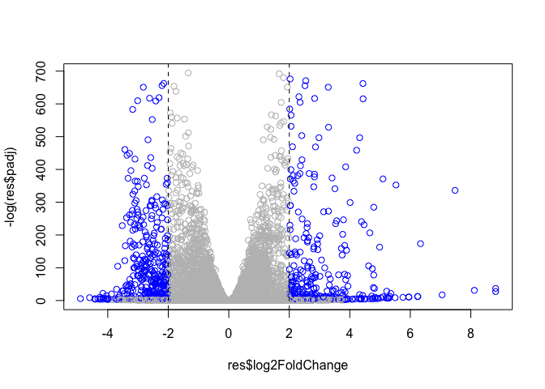

Class 13: RNASeq Mini Project
================
Suzanne Enos

# Read the countData and colData

``` r
countData <- read.csv("GSE37704_featurecounts.csv", row.names = 1)
head(countData)
```

                    length SRR493366 SRR493367 SRR493368 SRR493369 SRR493370
    ENSG00000186092    918         0         0         0         0         0
    ENSG00000279928    718         0         0         0         0         0
    ENSG00000279457   1982        23        28        29        29        28
    ENSG00000278566    939         0         0         0         0         0
    ENSG00000273547    939         0         0         0         0         0
    ENSG00000187634   3214       124       123       205       207       212
                    SRR493371
    ENSG00000186092         0
    ENSG00000279928         0
    ENSG00000279457        46
    ENSG00000278566         0
    ENSG00000273547         0
    ENSG00000187634       258

``` r
colData <- read.csv("GSE37704_metadata.csv")
head(colData)
```

             id     condition
    1 SRR493366 control_sirna
    2 SRR493367 control_sirna
    3 SRR493368 control_sirna
    4 SRR493369      hoxa1_kd
    5 SRR493370      hoxa1_kd
    6 SRR493371      hoxa1_kd

> Q. Do these match - No so lets fix them

``` r
countData <- countData[,-1]
#countData[, colData$id]
```

``` r
colnames(countData) == colData$id
```

    [1] TRUE TRUE TRUE TRUE TRUE TRUE

> Remove zero count genes

``` r
head(countData)
```

                    SRR493366 SRR493367 SRR493368 SRR493369 SRR493370 SRR493371
    ENSG00000186092         0         0         0         0         0         0
    ENSG00000279928         0         0         0         0         0         0
    ENSG00000279457        23        28        29        29        28        46
    ENSG00000278566         0         0         0         0         0         0
    ENSG00000273547         0         0         0         0         0         0
    ENSG00000187634       124       123       205       207       212       258

``` r
counts <- countData[rowSums(countData[])>0,]
head(counts)
```

                    SRR493366 SRR493367 SRR493368 SRR493369 SRR493370 SRR493371
    ENSG00000279457        23        28        29        29        28        46
    ENSG00000187634       124       123       205       207       212       258
    ENSG00000188976      1637      1831      2383      1226      1326      1504
    ENSG00000187961       120       153       180       236       255       357
    ENSG00000187583        24        48        65        44        48        64
    ENSG00000187642         4         9        16        14        16        16

> Q. How many genes do we have left?

``` r
nrow(counts)
```

    [1] 15975

# PCA as quality control

``` r
pc <- prcomp(t(counts), scale = TRUE)
summary(pc)
```

    Importance of components:
                               PC1     PC2      PC3      PC4      PC5       PC6
    Standard deviation     87.7211 73.3196 32.89604 31.15094 29.18417 6.648e-13
    Proportion of Variance  0.4817  0.3365  0.06774  0.06074  0.05332 0.000e+00
    Cumulative Proportion   0.4817  0.8182  0.88594  0.94668  1.00000 1.000e+00

> Q. How much variance is captured in the first two PCs?

81.82%

> Q. What does your score plot (PC1 vs PC2) look like when colored by
> condition (control/lockdown)

``` r
library(ggplot2)

x <- as.data.frame(pc$x)

ggplot(x) +
  aes(PC1, PC2, col = as.factor(colData$condition)) +
  geom_point()
```


# DeSeq Analysis

``` r
library(DESeq2)
```

    Loading required package: S4Vectors

    Loading required package: stats4

    Loading required package: BiocGenerics


    Attaching package: 'BiocGenerics'

    The following objects are masked from 'package:stats':

        IQR, mad, sd, var, xtabs

    The following objects are masked from 'package:base':

        anyDuplicated, aperm, append, as.data.frame, basename, cbind,
        colnames, dirname, do.call, duplicated, eval, evalq, Filter, Find,
        get, grep, grepl, intersect, is.unsorted, lapply, Map, mapply,
        match, mget, order, paste, pmax, pmax.int, pmin, pmin.int,
        Position, rank, rbind, Reduce, rownames, sapply, setdiff, sort,
        table, tapply, union, unique, unsplit, which.max, which.min


    Attaching package: 'S4Vectors'

    The following objects are masked from 'package:base':

        expand.grid, I, unname

    Loading required package: IRanges

    Loading required package: GenomicRanges

    Loading required package: GenomeInfoDb

    Loading required package: SummarizedExperiment

    Loading required package: MatrixGenerics

    Loading required package: matrixStats


    Attaching package: 'MatrixGenerics'

    The following objects are masked from 'package:matrixStats':

        colAlls, colAnyNAs, colAnys, colAvgsPerRowSet, colCollapse,
        colCounts, colCummaxs, colCummins, colCumprods, colCumsums,
        colDiffs, colIQRDiffs, colIQRs, colLogSumExps, colMadDiffs,
        colMads, colMaxs, colMeans2, colMedians, colMins, colOrderStats,
        colProds, colQuantiles, colRanges, colRanks, colSdDiffs, colSds,
        colSums2, colTabulates, colVarDiffs, colVars, colWeightedMads,
        colWeightedMeans, colWeightedMedians, colWeightedSds,
        colWeightedVars, rowAlls, rowAnyNAs, rowAnys, rowAvgsPerColSet,
        rowCollapse, rowCounts, rowCummaxs, rowCummins, rowCumprods,
        rowCumsums, rowDiffs, rowIQRDiffs, rowIQRs, rowLogSumExps,
        rowMadDiffs, rowMads, rowMaxs, rowMeans2, rowMedians, rowMins,
        rowOrderStats, rowProds, rowQuantiles, rowRanges, rowRanks,
        rowSdDiffs, rowSds, rowSums2, rowTabulates, rowVarDiffs, rowVars,
        rowWeightedMads, rowWeightedMeans, rowWeightedMedians,
        rowWeightedSds, rowWeightedVars

    Loading required package: Biobase

    Welcome to Bioconductor

        Vignettes contain introductory material; view with
        'browseVignettes()'. To cite Bioconductor, see
        'citation("Biobase")', and for packages 'citation("pkgname")'.


    Attaching package: 'Biobase'

    The following object is masked from 'package:MatrixGenerics':

        rowMedians

    The following objects are masked from 'package:matrixStats':

        anyMissing, rowMedians

``` r
dds <- DESeqDataSetFromMatrix(countData = counts,
                              colData = colData,
                              design = ~condition)
```

    Warning in DESeqDataSet(se, design = design, ignoreRank): some variables in
    design formula are characters, converting to factors

``` r
dds <- DESeq(dds)
```

    estimating size factors

    estimating dispersions

    gene-wise dispersion estimates

    mean-dispersion relationship

    final dispersion estimates

    fitting model and testing

``` r
res <- results(dds)
res 
```

    log2 fold change (MLE): condition hoxa1 kd vs control sirna 
    Wald test p-value: condition hoxa1 kd vs control sirna 
    DataFrame with 15975 rows and 6 columns
                     baseMean log2FoldChange     lfcSE       stat      pvalue
                    <numeric>      <numeric> <numeric>  <numeric>   <numeric>
    ENSG00000279457   29.9136      0.1792571 0.3248216   0.551863 5.81042e-01
    ENSG00000187634  183.2296      0.4264571 0.1402658   3.040350 2.36304e-03
    ENSG00000188976 1651.1881     -0.6927205 0.0548465 -12.630158 1.43990e-36
    ENSG00000187961  209.6379      0.7297556 0.1318599   5.534326 3.12428e-08
    ENSG00000187583   47.2551      0.0405765 0.2718928   0.149237 8.81366e-01
    ...                   ...            ...       ...        ...         ...
    ENSG00000273748  35.30265       0.674387  0.303666   2.220817 2.63633e-02
    ENSG00000278817   2.42302      -0.388988  1.130394  -0.344117 7.30758e-01
    ENSG00000278384   1.10180       0.332991  1.660261   0.200565 8.41039e-01
    ENSG00000276345  73.64496      -0.356181  0.207716  -1.714752 8.63908e-02
    ENSG00000271254 181.59590      -0.609667  0.141320  -4.314071 1.60276e-05
                           padj
                      <numeric>
    ENSG00000279457 6.86555e-01
    ENSG00000187634 5.15718e-03
    ENSG00000188976 1.76549e-35
    ENSG00000187961 1.13413e-07
    ENSG00000187583 9.19031e-01
    ...                     ...
    ENSG00000273748 4.79091e-02
    ENSG00000278817 8.09772e-01
    ENSG00000278384 8.92654e-01
    ENSG00000276345 1.39762e-01
    ENSG00000271254 4.53648e-05

# Summary plot

``` r
mycols <- rep("gray", nrow(res))
mycols[abs(res$log2FoldChange) > 2] <- "blue"
mycols[res$padj > 0.05] <- "gray"

plot( res$log2FoldChange, -log(res$padj), col = mycols )
abline(v = c(-2,2), lty=2)
```



``` r
library(AnnotationDbi)
library("org.Hs.eg.db")
```

``` r
columns(org.Hs.eg.db)
```

     [1] "ACCNUM"       "ALIAS"        "ENSEMBL"      "ENSEMBLPROT"  "ENSEMBLTRANS"
     [6] "ENTREZID"     "ENZYME"       "EVIDENCE"     "EVIDENCEALL"  "GENENAME"    
    [11] "GENETYPE"     "GO"           "GOALL"        "IPI"          "MAP"         
    [16] "OMIM"         "ONTOLOGY"     "ONTOLOGYALL"  "PATH"         "PFAM"        
    [21] "PMID"         "PROSITE"      "REFSEQ"       "SYMBOL"       "UCSCKG"      
    [26] "UNIPROT"     

``` r
res$symbol <- mapIds(org.Hs.eg.db, 
                     keys = rownames(counts),
                     keytype = "ENSEMBL",
                     column = "SYMBOL")
```

    'select()' returned 1:many mapping between keys and columns

``` r
res$entrez <- mapIds(org.Hs.eg.db, 
                     keys = rownames(counts),
                     keytype = "ENSEMBL",
                     column = "ENTREZID")
```

    'select()' returned 1:many mapping between keys and columns

``` r
head(res)
```

    log2 fold change (MLE): condition hoxa1 kd vs control sirna 
    Wald test p-value: condition hoxa1 kd vs control sirna 
    DataFrame with 6 rows and 8 columns
                     baseMean log2FoldChange     lfcSE       stat      pvalue
                    <numeric>      <numeric> <numeric>  <numeric>   <numeric>
    ENSG00000279457   29.9136      0.1792571 0.3248216   0.551863 5.81042e-01
    ENSG00000187634  183.2296      0.4264571 0.1402658   3.040350 2.36304e-03
    ENSG00000188976 1651.1881     -0.6927205 0.0548465 -12.630158 1.43990e-36
    ENSG00000187961  209.6379      0.7297556 0.1318599   5.534326 3.12428e-08
    ENSG00000187583   47.2551      0.0405765 0.2718928   0.149237 8.81366e-01
    ENSG00000187642   11.9798      0.5428105 0.5215598   1.040744 2.97994e-01
                           padj      symbol      entrez
                      <numeric> <character> <character>
    ENSG00000279457 6.86555e-01          NA          NA
    ENSG00000187634 5.15718e-03      SAMD11      148398
    ENSG00000188976 1.76549e-35       NOC2L       26155
    ENSG00000187961 1.13413e-07      KLHL17      339451
    ENSG00000187583 9.19031e-01     PLEKHN1       84069
    ENSG00000187642 4.03379e-01       PERM1       84808

# Pathway analysis

``` r
library(gage)
```

``` r
library(gageData)
library(pathview)
```

    ##############################################################################
    Pathview is an open source software package distributed under GNU General
    Public License version 3 (GPLv3). Details of GPLv3 is available at
    http://www.gnu.org/licenses/gpl-3.0.html. Particullary, users are required to
    formally cite the original Pathview paper (not just mention it) in publications
    or products. For details, do citation("pathview") within R.

    The pathview downloads and uses KEGG data. Non-academic uses may require a KEGG
    license agreement (details at http://www.kegg.jp/kegg/legal.html).
    ##############################################################################

Need to create the input for gage() - a vector of fold change values
with entrez IDs as the names()

``` r
foldchange <- res$log2FoldChange
names(foldchange) <- res$entrez
```

``` r
data(kegg.sets.hs)

keggres <- gage(foldchange, gsets = kegg.sets.hs)
head(keggres$less)
```

                                                      p.geomean stat.mean
    hsa04110 Cell cycle                            8.995727e-06 -4.378644
    hsa03030 DNA replication                       9.424076e-05 -3.951803
    hsa05130 Pathogenic Escherichia coli infection 1.405864e-04 -3.765330
    hsa03013 RNA transport                         1.246882e-03 -3.059466
    hsa03440 Homologous recombination              3.066756e-03 -2.852899
    hsa04114 Oocyte meiosis                        3.784520e-03 -2.698128
                                                          p.val       q.val
    hsa04110 Cell cycle                            8.995727e-06 0.001889103
    hsa03030 DNA replication                       9.424076e-05 0.009841047
    hsa05130 Pathogenic Escherichia coli infection 1.405864e-04 0.009841047
    hsa03013 RNA transport                         1.246882e-03 0.065461279
    hsa03440 Homologous recombination              3.066756e-03 0.128803765
    hsa04114 Oocyte meiosis                        3.784520e-03 0.132458191
                                                   set.size         exp1
    hsa04110 Cell cycle                                 121 8.995727e-06
    hsa03030 DNA replication                             36 9.424076e-05
    hsa05130 Pathogenic Escherichia coli infection       53 1.405864e-04
    hsa03013 RNA transport                              144 1.246882e-03
    hsa03440 Homologous recombination                    28 3.066756e-03
    hsa04114 Oocyte meiosis                             102 3.784520e-03

``` r
pathview(foldchange, pathway.id = "hsa04110")
```

    'select()' returned 1:1 mapping between keys and columns

    Info: Working in directory /Users/suzanneenos/Documents/bioinformatics/bggn213_github/class13

    Info: Writing image file hsa04110.pathview.png

``` r
pathview(gene.data=foldchange, pathway.id="hsa04110", kegg.native=FALSE)
```

    'select()' returned 1:1 mapping between keys and columns

    Info: Working in directory /Users/suzanneenos/Documents/bioinformatics/bggn213_github/class13

    Info: Writing image file hsa04110.pathview.pdf

# Gene Ontology

``` r
data(go.sets.hs)
data(go.subs.hs)

# Focus on Biological Process subset of GO
gobpsets = go.sets.hs[go.subs.hs$BP]

gobpres = gage(foldchange, gsets=gobpsets, same.dir=TRUE)

head(gobpres$less)
```

                                                p.geomean stat.mean        p.val
    GO:0048285 organelle fission             1.536227e-15 -8.063910 1.536227e-15
    GO:0000280 nuclear division              4.286961e-15 -7.939217 4.286961e-15
    GO:0007067 mitosis                       4.286961e-15 -7.939217 4.286961e-15
    GO:0000087 M phase of mitotic cell cycle 1.169934e-14 -7.797496 1.169934e-14
    GO:0007059 chromosome segregation        2.028624e-11 -6.878340 2.028624e-11
    GO:0000236 mitotic prometaphase          1.729553e-10 -6.695966 1.729553e-10
                                                    q.val set.size         exp1
    GO:0048285 organelle fission             5.841698e-12      376 1.536227e-15
    GO:0000280 nuclear division              5.841698e-12      352 4.286961e-15
    GO:0007067 mitosis                       5.841698e-12      352 4.286961e-15
    GO:0000087 M phase of mitotic cell cycle 1.195672e-11      362 1.169934e-14
    GO:0007059 chromosome segregation        1.658603e-08      142 2.028624e-11
    GO:0000236 mitotic prometaphase          1.178402e-07       84 1.729553e-10

Write out a text file of our genes for reactions

``` r
sig_genes <- res[res$padj <= 0.05 & !is.na(res$padj), "symbol"]
write.table(sig_genes, file="significant_genes.txt", row.names=FALSE, col.names=FALSE, quote=FALSE)
```
