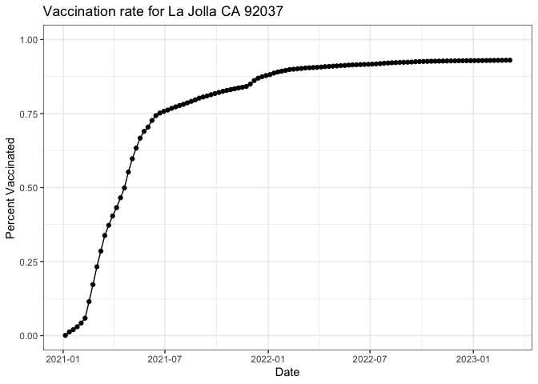

Class 17: Vaccination Rate Mini Project
================
Suzanne Enos

# Background

We’re exploring a dataset on statewide vaccination rate from CA.gov

The goal of this hands-on mini-project is to examine and compare the
Covid-19 vaccination rates around San Diego.

We will start by downloading the most recently dated “Statewide COVID-19
Vaccines Administered by ZIP Code” CSV file from:
https://data.ca.gov/dataset/covid-19-vaccine-progress-dashboard-data-by-zip-code

## Data Input

``` r
vax <- read.csv("covid19vaccinesbyzipcode_test.csv")
head(vax)
```

      as_of_date zip_code_tabulation_area local_health_jurisdiction          county
    1 2021-01-05                    93609                    Fresno          Fresno
    2 2021-01-05                    94086               Santa Clara     Santa Clara
    3 2021-01-05                    94304               Santa Clara     Santa Clara
    4 2021-01-05                    94110             San Francisco   San Francisco
    5 2021-01-05                    93420           San Luis Obispo San Luis Obispo
    6 2021-01-05                    93454             Santa Barbara   Santa Barbara
      vaccine_equity_metric_quartile                 vem_source
    1                              1 Healthy Places Index Score
    2                              4 Healthy Places Index Score
    3                              4 Healthy Places Index Score
    4                              4 Healthy Places Index Score
    5                              3 Healthy Places Index Score
    6                              2 Healthy Places Index Score
      age12_plus_population age5_plus_population tot_population
    1                4396.3                 4839           5177
    2               42696.0                46412          50477
    3                3263.5                 3576           3852
    4               64350.7                68320          72380
    5               26694.9                29253          30740
    6               32043.4                36446          40432
      persons_fully_vaccinated persons_partially_vaccinated
    1                       NA                           NA
    2                       11                          640
    3                       NA                           NA
    4                       18                         1262
    5                       NA                           NA
    6                       NA                           NA
      percent_of_population_fully_vaccinated
    1                                     NA
    2                               0.000218
    3                                     NA
    4                               0.000249
    5                                     NA
    6                                     NA
      percent_of_population_partially_vaccinated
    1                                         NA
    2                                   0.012679
    3                                         NA
    4                                   0.017436
    5                                         NA
    6                                         NA
      percent_of_population_with_1_plus_dose booster_recip_count
    1                                     NA                  NA
    2                               0.012897                  NA
    3                                     NA                  NA
    4                               0.017685                  NA
    5                                     NA                  NA
    6                                     NA                  NA
      bivalent_dose_recip_count eligible_recipient_count
    1                        NA                        1
    2                        NA                       11
    3                        NA                        6
    4                        NA                       18
    5                        NA                        4
    6                        NA                        5
                                                                   redacted
    1 Information redacted in accordance with CA state privacy requirements
    2 Information redacted in accordance with CA state privacy requirements
    3 Information redacted in accordance with CA state privacy requirements
    4 Information redacted in accordance with CA state privacy requirements
    5 Information redacted in accordance with CA state privacy requirements
    6 Information redacted in accordance with CA state privacy requirements

Correct way to store numeric dates: year-month-day

> Q1. What column details the total number of people fully vaccinated?

persons_fully_vaccinated

> Q2. What column details the Zip code tabulation area?

zip_code_tabulation_area

> What is the earliest date in this dataset?

2021-01-05

> Q4. What is the latest date in this dataset?

``` r
tail(vax)
```

           as_of_date zip_code_tabulation_area local_health_jurisdiction
    201091 2023-03-07                    93662                    Fresno
    201092 2023-03-07                    94801              Contra Costa
    201093 2023-03-07                    93668                    Fresno
    201094 2023-03-07                    93704                    Fresno
    201095 2023-03-07                    94510                    Solano
    201096 2023-03-07                    93726                    Fresno
                 county vaccine_equity_metric_quartile                 vem_source
    201091       Fresno                              1 Healthy Places Index Score
    201092 Contra Costa                              1 Healthy Places Index Score
    201093       Fresno                              1    CDPH-Derived ZCTA Score
    201094       Fresno                              1 Healthy Places Index Score
    201095       Solano                              4 Healthy Places Index Score
    201096       Fresno                              1 Healthy Places Index Score
           age12_plus_population age5_plus_population tot_population
    201091               24501.3                28311          30725
    201092               25273.6                29040          31210
    201093                1013.4                 1199           1219
    201094               24803.5                27701          29740
    201095               24819.2                27056          28350
    201096               33707.7                39067          42824
           persons_fully_vaccinated persons_partially_vaccinated
    201091                    20088                         2150
    201092                    27375                         2309
    201093                      644                           74
    201094                    17887                         1735
    201095                    22648                         2264
    201096                    24121                         2682
           percent_of_population_fully_vaccinated
    201091                               0.653800
    201092                               0.877123
    201093                               0.528302
    201094                               0.601446
    201095                               0.798871
    201096                               0.563259
           percent_of_population_partially_vaccinated
    201091                                   0.069976
    201092                                   0.073983
    201093                                   0.060705
    201094                                   0.058339
    201095                                   0.079859
    201096                                   0.062628
           percent_of_population_with_1_plus_dose booster_recip_count
    201091                               0.723776               10072
    201092                               0.951106               14782
    201093                               0.589007                 312
    201094                               0.659785               10435
    201095                               0.878730               16092
    201096                               0.625887               12104
           bivalent_dose_recip_count eligible_recipient_count redacted
    201091                      2578                    20066       No
    201092                      5342                    27282       No
    201093                        66                      644       No
    201094                      4154                    17822       No
    201095                      8797                    22501       No
    201096                      3585                    24062       No

``` r
vax$as_of_date[nrow(vax)]
```

    [1] "2023-03-07"

2023-03-07

# Use Skimr to get an overview of the dataset

If you just want to use one function from a package and not load the
whole package: package_name:: instead of library()

``` r
skimr::skim(vax)
```

|                                                  |        |
|:-------------------------------------------------|:-------|
| Name                                             | vax    |
| Number of rows                                   | 201096 |
| Number of columns                                | 18     |
| \_\_\_\_\_\_\_\_\_\_\_\_\_\_\_\_\_\_\_\_\_\_\_   |        |
| Column type frequency:                           |        |
| character                                        | 5      |
| numeric                                          | 13     |
| \_\_\_\_\_\_\_\_\_\_\_\_\_\_\_\_\_\_\_\_\_\_\_\_ |        |
| Group variables                                  | None   |

Data summary

**Variable type: character**

| skim_variable             | n_missing | complete_rate | min | max | empty | n_unique | whitespace |
|:--------------------------|----------:|--------------:|----:|----:|------:|---------:|-----------:|
| as_of_date                |         0 |             1 |  10 |  10 |     0 |      114 |          0 |
| local_health_jurisdiction |         0 |             1 |   0 |  15 |   570 |       62 |          0 |
| county                    |         0 |             1 |   0 |  15 |   570 |       59 |          0 |
| vem_source                |         0 |             1 |  15 |  26 |     0 |        3 |          0 |
| redacted                  |         0 |             1 |   2 |  69 |     0 |        2 |          0 |

**Variable type: numeric**

| skim_variable                              | n_missing | complete_rate |     mean |       sd |    p0 |      p25 |      p50 |      p75 |     p100 | hist  |
|:-------------------------------------------|----------:|--------------:|---------:|---------:|------:|---------:|---------:|---------:|---------:|:------|
| zip_code_tabulation_area                   |         0 |          1.00 | 93665.11 |  1817.38 | 90001 | 92257.75 | 93658.50 | 95380.50 |  97635.0 | ▃▅▅▇▁ |
| vaccine_equity_metric_quartile             |      9918 |          0.95 |     2.44 |     1.11 |     1 |     1.00 |     2.00 |     3.00 |      4.0 | ▇▇▁▇▇ |
| age12_plus_population                      |         0 |          1.00 | 18895.04 | 18993.87 |     0 |  1346.95 | 13685.10 | 31756.12 |  88556.7 | ▇▃▂▁▁ |
| age5_plus_population                       |         0 |          1.00 | 20875.24 | 21105.97 |     0 |  1460.50 | 15364.00 | 34877.00 | 101902.0 | ▇▃▂▁▁ |
| tot_population                             |      9804 |          0.95 | 23372.77 | 22628.50 |    12 |  2126.00 | 18714.00 | 38168.00 | 111165.0 | ▇▅▂▁▁ |
| persons_fully_vaccinated                   |     16621 |          0.92 | 13990.39 | 15073.66 |    11 |   932.00 |  8589.00 | 23346.00 |  87575.0 | ▇▃▁▁▁ |
| persons_partially_vaccinated               |     16621 |          0.92 |  1702.31 |  2033.32 |    11 |   165.00 |  1197.00 |  2536.00 |  39973.0 | ▇▁▁▁▁ |
| percent_of_population_fully_vaccinated     |     20965 |          0.90 |     0.57 |     0.25 |     0 |     0.42 |     0.61 |     0.74 |      1.0 | ▂▃▆▇▃ |
| percent_of_population_partially_vaccinated |     20965 |          0.90 |     0.08 |     0.09 |     0 |     0.05 |     0.06 |     0.08 |      1.0 | ▇▁▁▁▁ |
| percent_of_population_with_1\_plus_dose    |     22009 |          0.89 |     0.63 |     0.24 |     0 |     0.49 |     0.67 |     0.81 |      1.0 | ▂▂▅▇▆ |
| booster_recip_count                        |     72997 |          0.64 |  5882.76 |  7219.00 |    11 |   300.00 |  2773.00 |  9510.00 |  59593.0 | ▇▂▁▁▁ |
| bivalent_dose_recip_count                  |    158776 |          0.21 |  2978.23 |  3633.03 |    11 |   193.00 |  1467.50 |  4730.25 |  27694.0 | ▇▂▁▁▁ |
| eligible_recipient_count                   |         0 |          1.00 | 12830.83 | 14928.64 |     0 |   507.00 |  6369.00 | 22014.00 |  87248.0 | ▇▃▁▁▁ |

> Q5. How many numeric columns are in this dataset?

13

> Q6. Note that there are “missing values” in the dataset. How many NA
> values there in the persons_fully_vaccinated column?

16621

``` r
n.missing <- sum(is.na(vax$persons_fully_vaccinated))
n.missing
```

    [1] 16621

> Q7. What percent of persons_fully_vaccinated values are missing (to 2
> significant figures)?

``` r
round(n.missing/nrow(vax)*100, 2)
```

    [1] 8.27

# Working with dates

We will use the lubridate package to help ease the pain of working with
times and dates

``` r
library(lubridate)
```


    Attaching package: 'lubridate'

    The following objects are masked from 'package:base':

        date, intersect, setdiff, union

``` r
today()
```

    [1] "2023-03-17"

``` r
today() - ymd(vax$as_of_date[1])
```

    Time difference of 801 days

How old am I in days?

``` r
today() - ymd("2000-01-27")
```

    Time difference of 8450 days

> Q9. How many days have passed since the last update of the dataset?

``` r
today() - ymd(vax$as_of_date[nrow(vax)])
```

    Time difference of 10 days

``` r
vax$as_of_date <- ymd(vax$as_of_date)
```

``` r
today() - vax$as_of_date[nrow(vax)]
```

    Time difference of 10 days

> Q10. How many unique dates are in the dataset (i.e. how many different
> dates are detailed)?

``` r
length(unique(vax$as_of_date))
```

    [1] 114

``` r
library(dplyr)
```


    Attaching package: 'dplyr'

    The following objects are masked from 'package:stats':

        filter, lag

    The following objects are masked from 'package:base':

        intersect, setdiff, setequal, union

``` r
n_distinct(vax$as_of_date)
```

    [1] 114

# Working with zipcodes

Can use zipcodeR package to make this easier to work with

``` r
library(zipcodeR)
geocode_zip("30022")
```

    # A tibble: 1 × 3
      zipcode   lat   lng
      <chr>   <dbl> <dbl>
    1 30022    34.0 -84.2

``` r
zip_distance('92037', '92109')
```

      zipcode_a zipcode_b distance
    1     92037     92109     2.33

``` r
reverse_zipcode(c('92037', '92109', '30605') )
```

    # A tibble: 3 × 24
      zipcode zipcode…¹ major…² post_…³ common_c…⁴ county state   lat    lng timez…⁵
      <chr>   <chr>     <chr>   <chr>       <blob> <chr>  <chr> <dbl>  <dbl> <chr>  
    1 92037   Standard  La Jol… La Jol… <raw 20 B> San D… CA     32.8 -117.  Pacific
    2 92109   Standard  San Di… San Di… <raw 21 B> San D… CA     32.8 -117.  Pacific
    3 30605   Standard  Athens  Athens… <raw 18 B> Clark… GA     33.9  -83.3 Eastern
    # … with 14 more variables: radius_in_miles <dbl>, area_code_list <blob>,
    #   population <int>, population_density <dbl>, land_area_in_sqmi <dbl>,
    #   water_area_in_sqmi <dbl>, housing_units <int>,
    #   occupied_housing_units <int>, median_home_value <int>,
    #   median_household_income <int>, bounds_west <dbl>, bounds_east <dbl>,
    #   bounds_north <dbl>, bounds_south <dbl>, and abbreviated variable names
    #   ¹​zipcode_type, ²​major_city, ³​post_office_city, ⁴​common_city_list, …

> Finding best and worst ratio of household income to home prices

Find all SD zipcodes

``` r
sd.zip <- unique(vax$zip_code_tabulation_area[vax$county == "San Diego"])
length(sd.zip)
```

    [1] 107

``` r
sd.eco <- reverse_zipcode(sd.zip)
sd.eco
```

    # A tibble: 107 × 24
       zipcode zipcode…¹ major…² post_…³ common_c…⁴ county state   lat   lng timez…⁵
       <chr>   <chr>     <chr>   <chr>       <blob> <chr>  <chr> <dbl> <dbl> <chr>  
     1 91901   Standard  Alpine  Alpine… <raw 18 B> San D… CA     32.8 -117. Pacific
     2 91902   Standard  Bonita  Bonita… <raw 18 B> San D… CA     32.7 -117. Pacific
     3 91905   Standard  Boulev… Boulev… <raw 21 B> San D… CA     32.7 -116. Pacific
     4 91906   Standard  Campo   Campo,… <raw 17 B> San D… CA     32.7 -116. Pacific
     5 91910   Standard  Chula … Chula … <raw 23 B> San D… CA     32.6 -117. Pacific
     6 91911   Standard  Chula … Chula … <raw 23 B> San D… CA     32.6 -117. Pacific
     7 91913   Standard  Chula … Chula … <raw 23 B> San D… CA     32.6 -117. Pacific
     8 91914   Standard  Chula … Chula … <raw 23 B> San D… CA     32.7 -117. Pacific
     9 91915   Standard  Chula … Chula … <raw 23 B> San D… CA     32.6 -117. Pacific
    10 91916   Standard  Descan… Descan… <raw 20 B> San D… CA     32.9 -117. Pacific
    # … with 97 more rows, 14 more variables: radius_in_miles <dbl>,
    #   area_code_list <blob>, population <int>, population_density <dbl>,
    #   land_area_in_sqmi <dbl>, water_area_in_sqmi <dbl>, housing_units <int>,
    #   occupied_housing_units <int>, median_home_value <int>,
    #   median_household_income <int>, bounds_west <dbl>, bounds_east <dbl>,
    #   bounds_north <dbl>, bounds_south <dbl>, and abbreviated variable names
    #   ¹​zipcode_type, ²​major_city, ³​post_office_city, ⁴​common_city_list, …

Most expensive area?

``` r
ord <- order(sd.eco$median_household_income, decreasing=T)
head(sd.eco[ord,])
```

    # A tibble: 6 × 24
      zipcode zipcode_…¹ major…² post_…³ common_c…⁴ county state   lat   lng timez…⁵
      <chr>   <chr>      <chr>   <chr>       <blob> <chr>  <chr> <dbl> <dbl> <chr>  
    1 92145   Unique     San Di… San Di… <raw 21 B> San D… CA     32.9 -117. Pacific
    2 92091   Standard   Rancho… Rancho… <raw 33 B> San D… CA     33   -117. Pacific
    3 92130   Standard   San Di… San Di… <raw 21 B> San D… CA     33.0 -117. Pacific
    4 92067   PO Box     Rancho… Rancho… <raw 33 B> San D… CA     33.0 -117. Pacific
    5 92131   Standard   San Di… San Di… <raw 21 B> San D… CA     32.9 -117. Pacific
    6 92127   Standard   San Di… San Di… <raw 21 B> San D… CA     33.0 -117. Pacific
    # … with 14 more variables: radius_in_miles <dbl>, area_code_list <blob>,
    #   population <int>, population_density <dbl>, land_area_in_sqmi <dbl>,
    #   water_area_in_sqmi <dbl>, housing_units <int>,
    #   occupied_housing_units <int>, median_home_value <int>,
    #   median_household_income <int>, bounds_west <dbl>, bounds_east <dbl>,
    #   bounds_north <dbl>, bounds_south <dbl>, and abbreviated variable names
    #   ¹​zipcode_type, ²​major_city, ³​post_office_city, ⁴​common_city_list, …

``` r
head(arrange(sd.eco, desc(median_home_value)))
```

    # A tibble: 6 × 24
      zipcode zipcode_…¹ major…² post_…³ common_c…⁴ county state   lat   lng timez…⁵
      <chr>   <chr>      <chr>   <chr>       <blob> <chr>  <chr> <dbl> <dbl> <chr>  
    1 92014   Standard   Del Mar Del Ma… <raw 19 B> San D… CA     33.0 -117. Pacific
    2 92037   Standard   La Jol… La Jol… <raw 20 B> San D… CA     32.8 -117. Pacific
    3 92067   PO Box     Rancho… Rancho… <raw 33 B> San D… CA     33.0 -117. Pacific
    4 92118   Standard   Corona… Corona… <raw 33 B> San D… CA     32.6 -117. Pacific
    5 92145   Unique     San Di… San Di… <raw 21 B> San D… CA     32.9 -117. Pacific
    6 92091   Standard   Rancho… Rancho… <raw 33 B> San D… CA     33   -117. Pacific
    # … with 14 more variables: radius_in_miles <dbl>, area_code_list <blob>,
    #   population <int>, population_density <dbl>, land_area_in_sqmi <dbl>,
    #   water_area_in_sqmi <dbl>, housing_units <int>,
    #   occupied_housing_units <int>, median_home_value <int>,
    #   median_household_income <int>, bounds_west <dbl>, bounds_east <dbl>,
    #   bounds_north <dbl>, bounds_south <dbl>, and abbreviated variable names
    #   ¹​zipcode_type, ²​major_city, ³​post_office_city, ⁴​common_city_list, …

``` r
sd.eco$median_home_value
```

      [1]  472500  495600  273700  187100  340300  294900  387800  461300  365800
     [10]  254700  182800   70700  340900  145600  503900  489200  344600  287700
     [19]      NA  263500  336200   78200  296400  344400      NA  521500  196300
     [28]  743200  615200  641100  484200  665300 1000001  405000  380200  299000
     [37]  685700  404000  359500  304100  423600  486900  320500 1000001  340900
     [46]  426200      NA  353100  341000  261900  298700      NA  356100  495800
     [55]  383500  300000 1000001  362800  362000  323500  950300  369700  390700
     [64]  439800  284000  391800  169000  986000  448700  278500  546800  427200
     [73]  266700  834800  650700  285000  717300  466300  387100  238200  272300
     [82]  365800  447200  447300 1000001  423700  455800  569000  576200  396100
     [91]  519100  378400  618400  491300  577700  832900  627000      NA      NA
    [100]      NA  273400      NA 1000001      NA  269800      NA  254300

# Focus on the San Diego area

Using **dplyr** here

``` r
sd <- filter(vax, county == "San Diego")

nrow(sd)
```

    [1] 12198

> Q11. How many distinct zip codes are listed for San Diego County?

``` r
n_distinct(sd$zip_code_tabulation_area)
```

    [1] 107

> Q12. What San Diego County Zip code area has the largest 12 +
> Population in this dataset?

``` r
ind <- which.max(sd$age12_plus_population)
sd[ind,]
```

       as_of_date zip_code_tabulation_area local_health_jurisdiction    county
    67 2021-01-05                    92154                 San Diego San Diego
       vaccine_equity_metric_quartile                 vem_source
    67                              2 Healthy Places Index Score
       age12_plus_population age5_plus_population tot_population
    67               76365.2                82971          88979
       persons_fully_vaccinated persons_partially_vaccinated
    67                       16                         1400
       percent_of_population_fully_vaccinated
    67                                0.00018
       percent_of_population_partially_vaccinated
    67                                   0.015734
       percent_of_population_with_1_plus_dose booster_recip_count
    67                               0.015914                  NA
       bivalent_dose_recip_count eligible_recipient_count
    67                        NA                       16
                                                                    redacted
    67 Information redacted in accordance with CA state privacy requirements

> Q13. What is the overall average “Percent of Population Fully
> Vaccinated” value for all San Diego “County” as of “2023-03-07”?

``` r
library(dplyr)
sd.latest <- filter(sd, as_of_date == "2023-03-07")
mean(sd.latest$percent_of_population_fully_vaccinated, na.rm = TRUE)
```

    [1] 0.7402567

> Q14. Using either ggplot or base R graphics make a summary figure that
> shows the distribution of Percent of Population Fully Vaccinated
> values as of “2023-02-28”?

``` r
library(ggplot2)
ggplot(sd.latest) +
  aes(sd.latest$percent_of_population_fully_vaccinated) +
  geom_histogram(bins = 20) +
  theme_bw() +
  xlab("Percent of People Vaccinated")
```

    Warning: Use of `sd.latest$percent_of_population_fully_vaccinated` is discouraged.
    ℹ Use `percent_of_population_fully_vaccinated` instead.

    Warning: Removed 8 rows containing non-finite values (`stat_bin()`).


# Focus on UCSD/La Jolla

``` r
ucsd <- filter(sd, zip_code_tabulation_area == "92037")
ucsd[1,]$age5_plus_population
```

    [1] 36144

``` r
ljplot <- ggplot(ucsd) +
  aes(x = as_of_date, y = percent_of_population_fully_vaccinated) +
  geom_point() +
  geom_line(group=1) +
  ylim(c(0,1)) +
  labs(title = "Vaccination rate for La Jolla CA 92037", x = "Date", y = "Percent Vaccinated") +
  theme_bw()
ljplot
```



# Comparing to similar sized areas

``` r
vax.36 <- filter(vax, age5_plus_population > 36144 &
                as_of_date == "2023-03-07")
head(vax.36)
```

      as_of_date zip_code_tabulation_area local_health_jurisdiction         county
    1 2023-03-07                    94116             San Francisco  San Francisco
    2 2023-03-07                    92703                    Orange         Orange
    3 2023-03-07                    94118             San Francisco  San Francisco
    4 2023-03-07                    92376            San Bernardino San Bernardino
    5 2023-03-07                    92692                    Orange         Orange
    6 2023-03-07                    95148               Santa Clara    Santa Clara
      vaccine_equity_metric_quartile                 vem_source
    1                              4 Healthy Places Index Score
    2                              1 Healthy Places Index Score
    3                              4 Healthy Places Index Score
    4                              1 Healthy Places Index Score
    5                              4 Healthy Places Index Score
    6                              4 Healthy Places Index Score
      age12_plus_population age5_plus_population tot_population
    1               42334.3                45160          47346
    2               57182.7                64387          69112
    3               37628.5                40012          42095
    4               70232.1                79686          86085
    5               41008.9                44243          46800
    6               42163.3                46202          48273
      persons_fully_vaccinated persons_partially_vaccinated
    1                    41255                         2450
    2                    57887                         7399
    3                    33284                         3040
    4                    51367                         5674
    5                    35117                         2603
    6                    42298                         2684
      percent_of_population_fully_vaccinated
    1                               0.871351
    2                               0.837582
    3                               0.790688
    4                               0.596701
    5                               0.750363
    6                               0.876225
      percent_of_population_partially_vaccinated
    1                                   0.051747
    2                                   0.107058
    3                                   0.072218
    4                                   0.065912
    5                                   0.055620
    6                                   0.055600
      percent_of_population_with_1_plus_dose booster_recip_count
    1                               0.923098               34108
    2                               0.944640               28297
    3                               0.862906               27401
    4                               0.662613               23832
    5                               0.805983               23695
    6                               0.931825               31583
      bivalent_dose_recip_count eligible_recipient_count redacted
    1                     19158                    41000       No
    2                      7627                    57775       No
    3                     15251                    33146       No
    4                      6393                    51276       No
    5                     10169                    35031       No
    6                     12604                    42120       No

How many unique zipcodes?

``` r
n_distinct(vax.36$zip_code_tabulation_area)
```

    [1] 411

> Q16. Calculate the mean “Percent of Population Fully Vaccinated” for
> ZIP code areas with a population as large as 92037 (La Jolla)
> as_of_date “2023-02-28”. Add this as a straight horizontal line to
> your plot from above with the geom_hline() function

``` r
avg.36 <- mean(vax.36$percent_of_population_fully_vaccinated)
```

``` r
ljplot + 
  geom_hline(yintercept = avg.36, color = "red", linetype = 2)
```


> Q17. What is the 6 number summary (Min, 1st Qu., Median, Mean, 3rd
> Qu., and Max) of the “Percent of Population Fully Vaccinated” values
> for ZIP code areas with a population as large as 92037 (La Jolla)
> as_of_date “2023-02-28”?

``` r
summary(vax.36$percent_of_population_fully_vaccinated)
```

       Min. 1st Qu.  Median    Mean 3rd Qu.    Max. 
     0.3805  0.6459  0.7183  0.7215  0.7908  1.0000 

> Q18. Using ggplot generate a histogram of this data.

``` r
ggplot(vax.36) +
  aes(vax.36$percent_of_population_fully_vaccinated) +
  geom_histogram() +
  xlim(0,1) +
  labs(x = "Percent Vaccinated")
```

    Warning: Use of `vax.36$percent_of_population_fully_vaccinated` is discouraged.
    ℹ Use `percent_of_population_fully_vaccinated` instead.

    `stat_bin()` using `bins = 30`. Pick better value with `binwidth`.

    Warning: Removed 2 rows containing missing values (`geom_bar()`).


> Q19. Is the 92109 and 92040 ZIP code areas above or below the average
> value you calculated for all these above?

``` r
filter(vax.36, zip_code_tabulation_area %in% c("92109", "92040"))
```

      as_of_date zip_code_tabulation_area local_health_jurisdiction    county
    1 2023-03-07                    92109                 San Diego San Diego
    2 2023-03-07                    92040                 San Diego San Diego
      vaccine_equity_metric_quartile                 vem_source
    1                              3 Healthy Places Index Score
    2                              3 Healthy Places Index Score
      age12_plus_population age5_plus_population tot_population
    1               43222.5                44953          47111
    2               39405.0                42833          46306
      persons_fully_vaccinated persons_partially_vaccinated
    1                    32725                         4234
    2                    25493                         2156
      percent_of_population_fully_vaccinated
    1                               0.694636
    2                               0.550533
      percent_of_population_partially_vaccinated
    1                                   0.089873
    2                                   0.046560
      percent_of_population_with_1_plus_dose booster_recip_count
    1                               0.784509               19677
    2                               0.597093               14175
      bivalent_dose_recip_count eligible_recipient_count redacted
    1                      8109                    32622       No
    2                      4649                    25433       No

> Q20. Finally make a time course plot of vaccination progress for all
> areas in the full dataset with a age5_plus_population \> 36144.

``` r
vax.36.all <- filter(vax, age5_plus_population > 36144)

ggplot(vax.36.all) + 
  aes(x = as_of_date, y = percent_of_population_fully_vaccinated, group = zip_code_tabulation_area) + 
  geom_line(alpha = 0.2, color = "blue") +
  ylim(0,1) +
  labs(x = "Date", y = "Percent Vaccinated", title = "Vaccination rate across California", subtitle = "Areas with population >36k") +
  geom_hline(yintercept = avg.36, linetype = 2)
```

    Warning: Removed 183 rows containing missing values (`geom_line()`).


